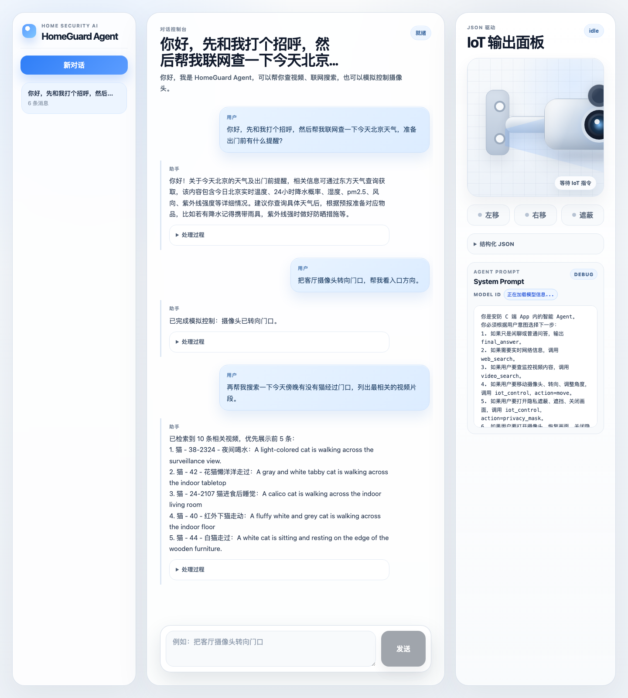

<div align="center">

<h1>HomeGuard Agent Web Demo</h1>

<p><strong>一个轻量级、可观测、工具驱动的家庭安防 AI Agent Web Demo</strong></p>

<p>
  
  
  
  
  
  
</p>

<p>
  <strong>100% 使用 Trae 编写与迭代</strong>，覆盖需求拆解、后端 Agent Loop、前端控制台、调试验证和文档整理。
</p>

</div>

项目演示一个“模型作为决策中心”的轻量级 Agent：大模型负责意图判断和工具选择，后端负责白名单工具执行、参数校验和结构化事件输出，前端负责聊天、工具轨迹、视频检索结果和模拟 IoT 状态展示。

> 当前项目是本地演示工程。IoT 控制为模拟状态变更，不会直接控制真实设备；视频搜索只读取既有 VikingDB collection / index，不负责建库、切片或写入向量。

## 演示截图

下图来自本地实际运行页面，同一段对话里依次触发联网搜索、IoT 模拟控制和 VikingDB 视频检索。



## 功能特性

- 多轮聊天：前端维护会话列表和历史消息，后端支持 conversation id。
- 流式响应：核心接口为 `POST /api/chat/stream`，通过 SSE 输出 Agent 处理过程和最终回答。
- 可观测 Agent Loop：前端展示用户意图、上下文打包、模型决策、工具调用、Observation 回填、最终回复等步骤。
- 联网搜索：天气优先走 `wttr.in`，通用搜索支持 DuckDuckGo / Bing 降级。
- 视频搜索：通过 VikingDB 多模态检索接口读取监控视频片段结果。
- IoT 模拟控制：支持摄像头转向、隐私遮蔽、恢复画面等模拟动作。
- 准确性评测：`backend/evals` 和 `backend/scripts/evaluate_agent_accuracy.py` 提供路由、工具调用、参数匹配和安全边界评测基础。

## 技术栈

- 后端：Python 3.12、FastAPI、Pydantic、pytest、Volcengine Ark SDK、VikingDB SDK 签名请求。
- 前端：React 18、TypeScript、Vite。
- Agent 架构：单一事件驱动核心循环 `AgentLoop.iter_agent_events()`，同步和流式链路复用同一套决策流程。

## 项目结构

```text
.
├── backend/
│   ├── app/
│   │   ├── agent/          # Agent Loop、Prompt、Schema、工具注册
│   │   ├── api/            # FastAPI 路由
│   │   ├── core/           # 配置和日志
│   │   ├── memory/         # 本地会话存储
│   │   ├── model/          # Ark SDK 客户端
│   │   └── tools/          # web_search / video_search / iot_control
│   ├── evals/              # Agent 准确性评测用例与报告
│   ├── scripts/            # 评测脚本
│   └── tests/              # 后端测试
├── frontend/
│   ├── src/                # React 页面、组件、API client
│   └── package.json
├── docs/                   # 架构说明和可视化文档
└── README.md
```

## 快速开始

### 1. 配置后端环境变量

复制示例配置文件：

```bash
cp backend/.env.example backend/.env
```

然后在 `backend/.env` 中填入自己的本地凭据。不要把 `.env` 文件提交到 GitHub。

最小可运行配置：

```text
ARK_API_KEY=your_ark_api_key
ARK_BASE_URL=https://ark.cn-beijing.volces.com/api/v3
ARK_MODEL=doubao-seed-1-6-250615
ARK_REASONING_EFFORT=
```

如需启用 VikingDB 视频搜索，还需要配置：

```text
VIKINGDB_AK=your_vikingdb_ak
VIKINGDB_SK=your_vikingdb_sk
VIKINGDB_HOST=api-vikingdb.vikingdb.ap-southeast-1.bytepluses.com
VIKINGDB_REGION=ap-southeast-1
VIKINGDB_PROJECT_NAME=default
VIKINGDB_COLLECTION_NAME=your_collection_name
VIKINGDB_INDEX_NAME=your_index_name
```

### 2. 启动后端

```bash
cd backend
python3 -m pip install -r requirements.txt
PYTHONPATH=. python3 -m uvicorn app.main:app --host 127.0.0.1 --port 8000
```

健康检查：

```bash
curl http://127.0.0.1:8000/api/health
```

### 3. 启动前端

```bash
cd frontend
npm install
npm run dev
```

访问：

```text
http://127.0.0.1:5173
```

## API 概览

- `GET /api/health`：服务状态和 VikingDB 配置状态。
- `GET /api/system-prompt`：查看当前系统提示词。
- `POST /api/chat/stream`：SSE 流式聊天接口，输出 session、architecture_status、model_input、model_output、tool_call、tool_result、final、done 等事件。

## 测试与验证

后端测试：

```bash
cd backend
PYTHONPATH=. python3 -m pytest tests -v
```

前端构建：

```bash
cd frontend
npm run build
```

Agent 准确性评测：

```bash
cd backend
PYTHONPATH=. python3 scripts/evaluate_agent_accuracy.py
```

## 配置说明

配置由 `backend/app/core/config.py` 读取，支持根目录 `.env` 和 `backend/.env`。本地开发推荐使用 `backend/.env`，公开仓库只保留 `backend/.env.example`。

未配置 `ARK_API_KEY` 时，前端可以启动，但模型聊天接口会返回可读错误。未配置 VikingDB AK/SK 时，视频搜索工具会返回配置缺失错误，其他能力不受影响。
