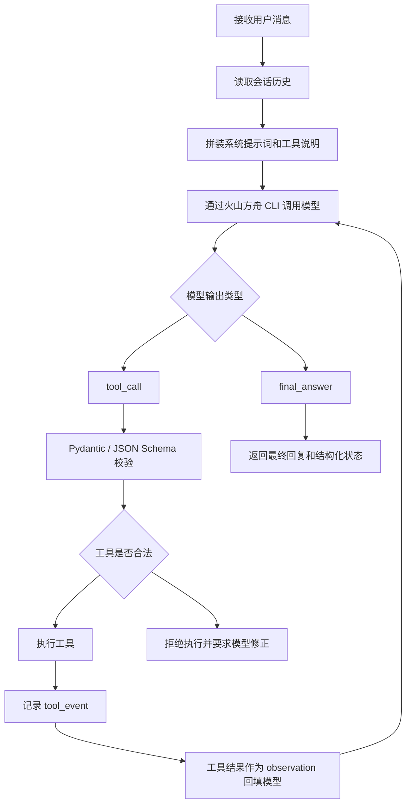

# 安防 C 端智能 Agent Web Demo 规格设计

## 1. 背景

目标是构建一个面向安防厂商 C 端 App 的智能 Agent 产品 Demo。用户在厂商自己的 App 或内嵌 Web 页面中与 Agent 对话，Agent 能进行多轮闲聊、联网搜索、视频搜索，并模拟 IoT 摄像头控制。

本项目不是关键词规则机器人，而是模型主导的工具型 Agent：模型负责理解用户意图、选择工具、生成工具参数和总结回复；后端负责校验、执行、兜底和把稳定结构化状态返回前端。

## 2. 已确认决策

| 决策项 | 结论 |
|--------|------|
| 产品形态 | Web 页面 Demo，可被安防厂商 C 端 App 内嵌 |
| 页面布局 | 左侧对话窗口，右侧摄像头模拟预览 + “移动/遮蔽”状态按钮 |
| Agent 形态 | 模型主导工具选择，不使用关键词路由作为主逻辑 |
| 模型接入 | 所有 LLM 调用统一通过火山方舟 CLI |
| IoT 控制 | 只做模拟控制，输出稳定 JSON，不接真实设备 |
| 视频搜索 | 使用 VikingDB，建库流程可由用户人工完成 |
| 参考代码 | 参考 `demo.py` 中 VikingDB 检索请求结构，不复用非方舟模型 provider |

## 3. MVP 范围

### 3.1 必须包含

- React Web 页面：聊天区、输入框、消息列表、右侧摄像头状态面板。
- FastAPI 后端：提供 `/api/chat` 和 `/api/health`。
- 多轮会话：同一个 `conversation_id` 下保留上下文。
- Agent Loop：模型输出工具调用 JSON，后端执行工具，工具结果回填模型后生成最终回答。
- 火山方舟 CLI 封装：所有模型调用通过 `ArkCLIModelClient`。
- IoT 模拟工具：支持 `move`、`privacy_mask`、`none` 三类状态。
- 联网搜索工具：作为 Agent 可选工具接入。
- VikingDB 视频搜索工具：封装基础查询和结果解析。
- 工具轨迹：返回 `tool_events`，前端可折叠展示。

### 3.2 暂不包含

- 真实摄像头视频流。
- 真实 IoT 设备协议。
- 用户登录和设备绑定。
- 数据库存储会话。
- 生产级权限、审计、监控和限流。
- `demo.py` 中 DashScope、Voyage、Qwen 等非方舟模型调用。

## 4. 产品交互

### 4.1 页面结构

```text
┌──────────────────────────────────────────────────────────────┐
│ 顶部品牌栏：HomeGuard Agent / 能力标签                        │
├─────────────────────────────────────┬────────────────────────┤
│ 左侧：对话窗口                       │ 右侧：IoT 输出面板      │
│ - 用户消息                           │ - 摄像头模拟插画        │
│ - Agent 回复                         │ - “移动”状态按钮        │
│ - 工具轨迹折叠摘要                   │ - “遮蔽”状态按钮        │
│ - 输入框 + 发送按钮                  │ - JSON 状态说明         │
└─────────────────────────────────────┴────────────────────────┘
```

### 4.2 IoT 状态映射

| 后端字段 | 前端效果 |
|----------|----------|
| `iot_action = "move"` | 点亮“移动”按钮，关闭“遮蔽”按钮高亮 |
| `iot_action = "privacy_mask"` | 点亮“遮蔽”按钮，关闭“移动”按钮高亮 |
| `iot_action = "none"` | 两个按钮都不高亮 |

前端不能从自然语言回复中推断按钮状态，只能读取后端结构化字段。

## 5. Agent 架构

### 5.1 Agent Loop



### 5.2 工具定义

| 工具 | 触发场景 | 输入 | 输出 |
|------|----------|------|------|
| `web_search` | 用户询问实时信息、新闻、天气、通用网络事实 | `query`, `top_k` | 搜索结果标题、摘要、URL |
| `video_search` | 用户查找视频片段或描述监控内容 | `query`, `limit` | `f_id`, `f_text`, `score` |
| `iot_control` | 用户要求移动摄像头或打开隐私遮蔽 | `device_id`, `action`, `target` | `iot_action`, `status`, `raw_command` |

### 5.3 模型输出协议

模型必须输出 JSON。工具调用示例：

```json
{
  "type": "tool_call",
  "tool_name": "iot_control",
  "arguments": {
    "device_id": "camera_living_room",
    "action": "move",
    "target": "front_door"
  },
  "reason": "用户要求将客厅摄像头转向门口"
}
```

最终回复示例：

```json
{
  "type": "final_answer",
  "answer": "好的，我已经模拟将客厅摄像头转向门口。",
  "iot_action": "move"
}
```

### 5.4 安全边界

- 模型不能直接控制前端状态，必须通过后端 schema 校验后的字段传递。
- 模型不能调用未注册工具。
- 模型输出未知 `action` 时，后端返回 `iot_action = "none"` 并记录校验失败。
- Agent Loop 设置最大步数，避免循环调用工具。

## 6. 火山方舟 CLI 接入

### 6.1 硬约束

所有 LLM 调用只能通过 `ArkCLIModelClient`，包括：

- 意图理解。
- 工具选择。
- 工具参数生成。
- 联网搜索结果总结。
- 视频搜索结果总结。
- 最终自然语言回复。

业务代码不得直接调用模型 SDK 或模型 HTTP API。

### 6.2 封装职责

`ArkCLIModelClient` 负责：

- 读取 CLI 路径、模型名称、超时和重试配置。
- 执行火山方舟 CLI。
- 捕获 stdout、stderr 和退出码。
- 解析模型 JSON 输出。
- 在 JSON 解析失败时执行一次修复提示。
- 把错误转成稳定异常码，例如 `ARK_CLI_NOT_FOUND`、`ARK_AUTH_EXPIRED`、`MODEL_JSON_PARSE_FAILED`。

## 7. 视频搜索设计

### 7.1 VikingDB 检索

视频搜索工具基于 VikingDB Data API。MVP 输入自然语言 query，输出候选视频片段。参考 `demo.py` 的核心结构：

- `ClientForDataApi`：负责签名请求。
- `SEARCH_PATH = "/api/vikingdb/data/search/multi_modal"`。
- `search_vikingdb`：构造请求并解析 `f_id`、`f_text`、`score`、`ann_score`。

### 7.2 与 `demo.py` 的差异

`demo.py` 是评测脚本，包含 grid search、rerank、HTML 可视化和多 provider rerank。MVP 产品链路只复用 VikingDB 基础检索逻辑，不引入：

- DashScope rerank。
- Voyage rerank。
- Qwen rerank。
- 评测指标计算。
- 网格搜索。

如果后续需要 rerank，优先通过火山方舟 CLI 做模型重排或结果总结，避免破坏“模型统一走方舟 CLI”的约束。

## 8. API 协议

### 8.1 聊天请求

```json
{
  "conversation_id": "optional-existing-session-id",
  "message": "帮我把摄像头转向门口",
  "debug": true
}
```

### 8.2 聊天响应

```json
{
  "conversation_id": "conv_123",
  "assistant_message": "好的，我已经模拟将摄像头转向门口。",
  "iot_state": {
    "iot_action": "move",
    "device_id": "camera_living_room",
    "target": "front_door",
    "status": "simulated_success"
  },
  "video_results": [],
  "tool_events": [
    {
      "step": 1,
      "tool_name": "iot_control",
      "input": {
        "device_id": "camera_living_room",
        "action": "move",
        "target": "front_door"
      },
      "output": {
        "iot_action": "move",
        "status": "simulated_success"
      },
      "status": "success",
      "elapsed_ms": 12
    }
  ]
}
```

## 9. 日志与可观测性

每轮请求必须记录：

- `conversation_id`。
- 用户消息长度。
- Agent step 数量。
- 每次火山方舟 CLI 调用耗时、退出码和错误摘要。
- 每次工具调用的工具名、参数、状态和耗时。
- JSON 校验失败原因。
- VikingDB 请求耗时和结果数量。

日志不记录敏感密钥，不直接打印 AK/SK，不保存完整 SSO token。

## 10. 测试策略

### 10.1 后端测试

- 使用 fake `ArkCLIModelClient` 模拟模型输出，验证 Agent Loop 真正按模型的 `tool_call` 执行工具。
- 验证模型输出非法 JSON 时，后端不会执行工具。
- 验证 `iot_control` 的 `move`、`privacy_mask`、`none` 输出稳定。
- 使用 mock HTTP 验证 VikingDB 结果解析。

### 10.2 前端测试

- 输入消息后调用 `/api/chat`，消息列表追加用户消息和 Agent 回复。
- 响应 `iot_action = "move"` 时，“移动”按钮高亮。
- 响应 `iot_action = "privacy_mask"` 时，“遮蔽”按钮高亮。
- 响应 `tool_events` 时，工具轨迹默认折叠且可展开。

## 11. 风险与处理

| 风险 | 处理方式 |
|------|----------|
| 火山方舟 CLI 输出格式不稳定 | 集中封装 JSON 解析、修复提示和错误码 |
| SSO token 过期 | `/api/health` 和 `/api/chat` 返回明确认证错误 |
| 模型选择错误工具 | 后端只允许注册工具，非法工具不执行 |
| IoT JSON 字段漂移 | Pydantic schema 校验，不合格则返回 `iot_action = "none"` |
| VikingDB 建库未完成 | 工具返回可读错误，不阻塞闲聊、联网搜索和 IoT 演示 |
| 联网搜索 provider 不稳定 | 工具层保持可替换，失败时 Agent 解释搜索不可用 |

## 12. 下一步实施计划边界

用户确认本规格后，进入实施计划阶段。计划应拆成以下任务：

1. 创建 FastAPI 后端骨架和健康检查。
2. 实现 `ArkCLIModelClient` 与 fake 测试客户端。
3. 实现 Agent schema、ToolRegistry 和 AgentLoop。
4. 实现 IoT 模拟工具和单元测试。
5. 实现 `/api/chat`。
6. 实现 React 前端聊天页和 IoT 面板。
7. 接入联网搜索工具。
8. 封装 VikingDB 视频搜索工具。
9. 增加工具轨迹展示和日志。
10. 完成端到端验证。

## 13. 自审结果

- 范围聚焦在 Web Demo + Agent 后端，不包含真实设备和生产账号体系。
- Agent 定义明确：模型主导工具选择，后端强校验。
- 火山方舟 CLI 作为模型唯一入口已写成硬约束。
- IoT 前端状态由结构化 JSON 驱动，不解析自然语言。
- VikingDB 只作为视频搜索工具，建库流程明确不在本期实现。
